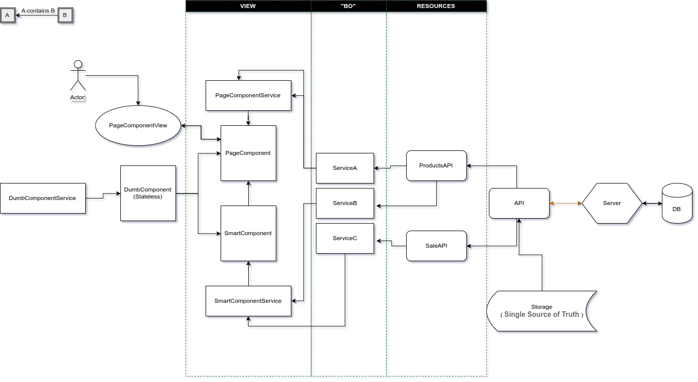
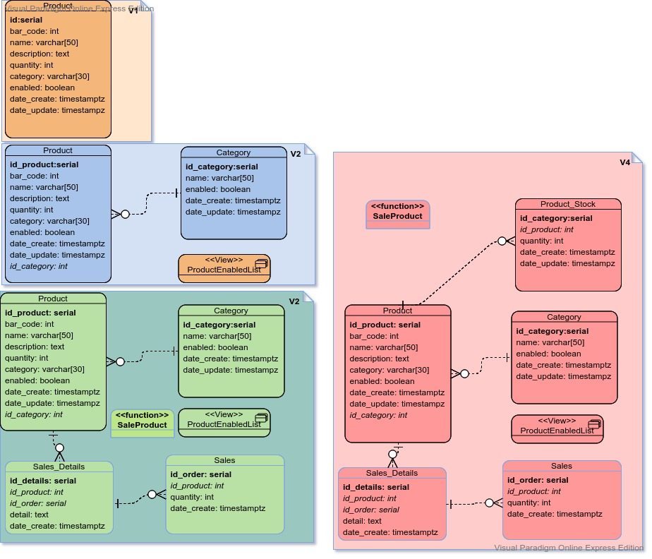
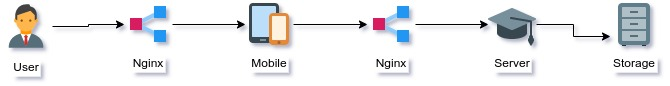
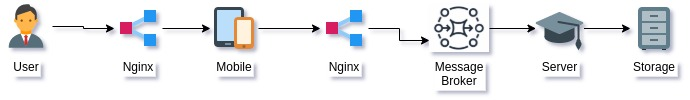
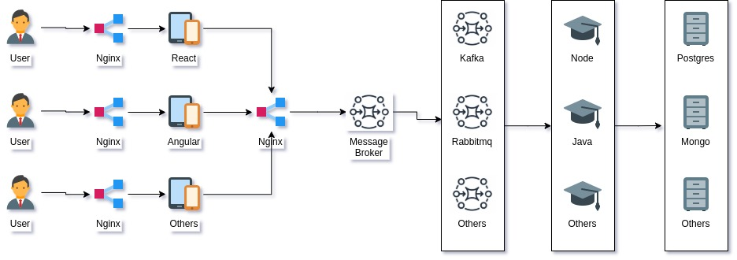

# Purpose

Create a minimal app with different technologies

## What the program should do

* <strong>C</strong>reate products
* <strong>R</strong>ead products
* <strong>U</strong>pdate products
* <strong>D</strong>elete products
* Show products details
* Sale prodcuts

# Install dependencies

* [Node](https://nodejs.org/en/download/)
* [Docker](https://docs.docker.com/docker-for-windows/install/)

# Running

## Create database

    $ cd /db/postgres
    $ docker build -t products-postgres-db .
    $ docker run -d -p 5432:5432 products-postgres-db

## Start server

    $ cd /server/java
    $ ./gradlew bootRun

## Start client

    $ cd /client/angular
    $ npm i
    $ npm start  

* `docker-compose` coming soon

# Technologies

Here you will find:

## Client (`/client`)

* AngularJS ( coming soon )
* Angular  ( WIP )
* React ( coming soon )
* Vue ( coming soon )
* Flutter ( coming soon )
* Elm ( coming soon )
* Unity C# ( coming soon )
* Godot ( coming soon )
* Haxe ( coming soon )

## Server (`/server`)

* Java Spring Boot  ( WIP )
* Kotlin Spring Boot  ( coming soon )
* NodeJs Express ( WIP )
* NodeJs Kha ( coming soon )
* Python Flask  ( coming soon )
* GoLang ( coming soon )

## Database (`/db`)

* Mongo (WIP)
* Couch ( coming soon )
* PostgreSQL ( :heavy_check_mark: )
* Mysql ( coming soon )

## Others 

* Docker ( WIP )
* Kubernetes ( coming soon )
* Redis  ( coming soon )
* Rabbitmq  ( coming soon )

# Organising

The project structure based on features.

@see https://www.freecodecamp.org/news/how-to-structure-your-project-and-manage-static-resources-in-react-native-6f4cfc947d92/

# Test

* E2E
* Monkey Testing (gremlins)
* TDD / BDD
* Integration tests 
* Others

# Some docs

## Architecture

### FrontEnd

(without Redux)

## ERM

## Topology

v1

v2

Where I want to get to

# Toolchain Links

- [angulajs (vanilla)](https://angularjs.org/)
- [angular N](https://angular.io/)
- [react](https://pt-br.reactjs.org/)
- [vue](https://vuejs.org/)
- [flutter](https://flutter.dev/)
- [typescript](https://www.typescriptlang.org/)
- [dart](https://dart.dev/)
- [nodejs](https://nodejs.org/en/)
- [spring](https://spring.io/projects/spring-boot)
- [yeoman](https://yeoman.io/)
- [protractor](http://www.protractortest.org/#/)
- [karma](https://karma-runner.github.io/latest/index.html)
- [gulp@3.n](https://gulpjs.com/)
- [sass](https://sass-lang.com/)
- [bootstrap](https://getbootstrap.com/docs/3.3/)
- [docker](https://www.docker.com/)
- [sinonjs](https://sinonjs.org/)
- [protractor](https://www.protractortest.org/#/)
- [mocha](https://mochajs.org/)
- [chai](https://www.chaijs.com/)
- [babel](https://babeljs.io/)
- [webpack](https://webpack.js.org/)
- [flask](https://palletsprojects.com/p/flask/)
- [nginx](https://www.nginx.com)

# Author

@Name: Fabricio Goncalves (Espigah)

@Twitter: https://twitter.com/espigah

@Linkdin: https://www.linkedin.com/in/fabricio-gon%C3%A7alves-919a4424/

@Git: https://github.com/Espigah

@Blog: https://fabriciogoncalves.com

@email: fsrg@outlook.com

